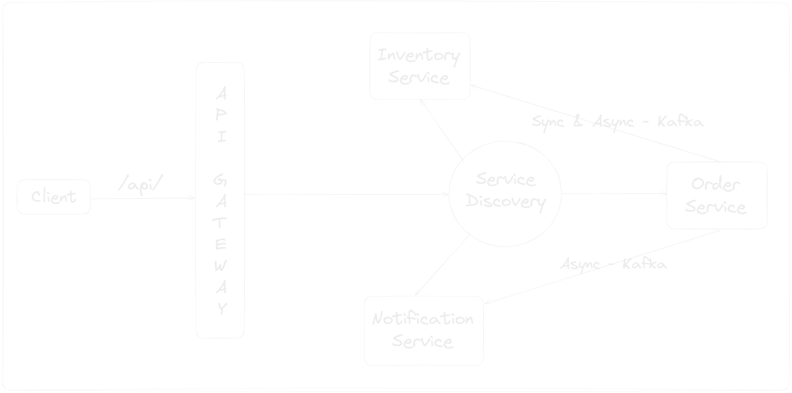
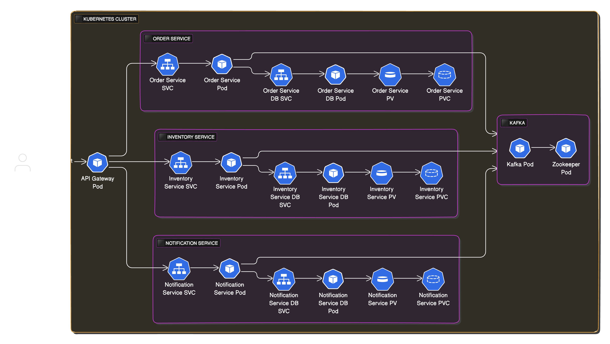

# Ecommerce Microservices Application in Kotlin

## Architecture Diagram

## Microservices Architecture Design Patterns

In this project, I have implemented several design patterns commonly used in microservices architecture

| Design Pattern                    | Tools                                                                                                                                  | Description                                                                                                      |
|-----------------------------------|----------------------------------------------------------------------------------------------------------------------------------------|------------------------------------------------------------------------------------------------------------------|
| **Service Discovery**             | [Spring Cloud Netflix](https://spring.io/projects/spring-cloud-netflix)                                                                | Service discovery automatically detects services for communication without relying on hardcoded addresses.       |
| **API Gateway**                   | [Spring Cloud Gateway](https://spring.io/projects/spring-cloud-gateway)                                                                | Single entry for managing, routing, and securing requests between clients and services.                          |
| **Circuit Breaker**               | [Resilience4j](https://resilience4j.readme.io/docs)                                                                                    | Prevents cascading failures by stopping repeated requests to a failing service and allowing it to recover.       |
| **Distributed Messaging System**  | [Apache Kafka](https://kafka.apache.org/)                                                                                              | Asynchronous communication between services in microservices environment.                                        |
| **Transactional Outbox Pattern**  | [Scheduler](https://docs.spring.io/spring-framework/docs/current/javadoc-api/org/springframework/scheduling/annotation/Scheduled.html) | Resolves the dual write problem by storing messages in an outbox table, ensuring consistency with business data. |
| **Event Inbox Pattern**           | [Inbox Database Table](https://softwaremill.com/microservices-101/#inbox-pattern)                                                      | Processes incoming events by storing them in an inbox table, ensuring idempotency and consistency.               |
| **Distributed Scheduler Locking** | [ShedLock](https://github.com/lukas-krecan/ShedLock)                                                                                   | Ensures only one instance of a scheduled task runs across multiple parallel application instances.               |

## Security Testing Topics

I have implemented below security testing automation pipelines

| Security Topic                       | Tools                                                                             | Implemented Pipeline                                                                       |
|--------------------------------------|-----------------------------------------------------------------------------------|--------------------------------------------------------------------------------------------|
| Static Application Security Testing  | [OWASP dependency-check](https://jeremylong.github.io/DependencyCheck/index.html) | [Service Vulnerability Scanner](.github/workflows/service-vulnerability-scanner.yaml)      | 
| Static Application Security Testing  | [Trivy Docker Image Scanner](https://trivy.dev/)                                  | [Service Docker Image Scanner](.github/workflows/service-image-vulnerability-scanner.yaml) | 
| Dynamic Application Security Testing | [OWASP ZAP Scanner](https://www.zaproxy.org/)                                     | [Service DAST Scanner](.github/workflows/service-dast-scanner.yaml)                        | 

## Kubernetes Architecture Diagram

## Kubernetes Architecture Components

|                             | Order Service                                                                                       | Inventory Service                                                                                           | Notification Service                                                                                              | API Gateway                                                                     |
|-----------------------------|-----------------------------------------------------------------------------------------------------|-------------------------------------------------------------------------------------------------------------|-------------------------------------------------------------------------------------------------------------------|---------------------------------------------------------------------------------|
| **Docker Image**            | `shaikrasheed99/order-service`                                                                      | `shaikrasheed99/inventory-service`                                                                          | `shaikrasheed99/notification-service`                                                                             | `shaikrasheed99/api-gateway`                                                    |                                         
| **Deployment**              | `order-service-deploy`   - [Manifest](k8s/deployments/order-service-deploy.yaml)                | `inventory-service-deploy`  - [Manifest](k8s/deployments/inventory-service-deploy.yaml)                 | `notification-service-deploy`  - [Manifest](k8s/deployments/notification-service-deploy.yaml)                 | `api-gateway-deploy`  - [Manifest](k8s/deployments/api-gateway-deploy.yaml) |
| **Service**                 | `order-service-svc`  - [Manifest](k8s/services/order-service-svc.yaml)                          | `inventory-service-svc`  - [Manifest](k8s/services/inventory-service-svc.yaml)                          | `notification-service-svc`  - [Manifest](k8s/services/notification-service-svc.yaml)                          | `api-gateway-svc`  - [Manifest](k8s/services/api-gateway-svc.yaml)          |
| **Service Type**            | `ClusterIP`                                                                                         | `ClusterIP`                                                                                                 | `ClusterIP`                                                                                                       | `NodePort` - `30000`                                                            |
| **Database Deployment**     | `order-service-db-deploy`  - [Manifest](k8s/deployments/databases/order-service-db-deploy.yaml) | `inventory-service-db-deploy`  - [Manifest](k8s/deployments/databases/inventory-service-db-deploy.yaml) | `notification-service-db-deploy`  - [Manifest](k8s/deployments/databases/notification-service-db-deploy.yaml) |                                                                                 |
| **Database Service**        | `order-service-db-svc`  - [Manifest](k8s/services/databases/order-service-db-svc.yaml)          | `inventory-service-db-svc`  - [Manifest](k8s/services/databases/inventory-service-db-svc.yaml)          | `notification-service-db-svc`  - [Manifest](k8s/services/databases/notification-service-db-svc.yaml)          |                                                                                 |
| **Persistent Volume**       | `order-service-pv`  - [Manifest](k8s/persistent-volumes/order-service-pv.yaml)                  | `inventory-service-pv`  - [Manifest](k8s/persistent-volumes/inventory-service-pv.yaml)                  | `notification-service-pv`  - [Manifest](k8s/persistent-volumes/notification-service-pv.yaml)                  |                                                                                 |
| **Persistent Volume Claim** | `order-service-pvc`  - [Manifest](k8s/persistent-volume-claims/order-service-pvc.yaml)          | `inventory-service-pvc`  - [Manifest](k8s/persistent-volume-claims/inventory-service-pvc.yaml)          | `notification-service-pvc`  - [Manifest](k8s/persistent-volume-claims/notification-service-pvc.yaml)          |                                                                                 |
