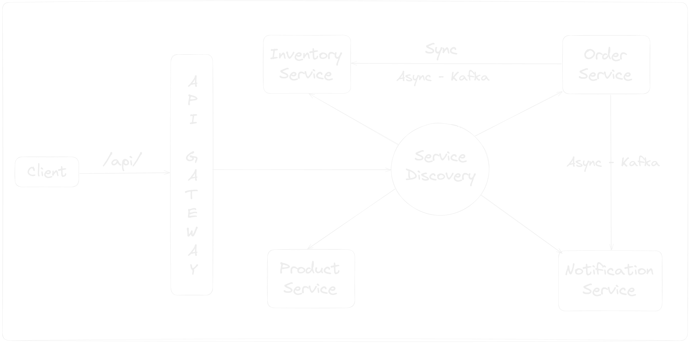

# Ecommerce Microservices Application in Kotlin

## Architecture Diagram

## Microservices Architecture Design Patterns

In this project, I have implemented several design patterns commonly used in microservices architecture

| Design Pattern               | Tools                                                                                                                                  |
|------------------------------|----------------------------------------------------------------------------------------------------------------------------------------|
| Service Discovery            | [Spring Cloud Netflix](https://spring.io/projects/spring-cloud-netflix)                                                                |
| API Gateway                  | [Spring Cloud Gateway](https://spring.io/projects/spring-cloud-gateway)                                                                |
| Circuit Breaker              | [Resilience4j](https://resilience4j.readme.io/docs)                                                                                    |
| Distributed Messaging System | [Apache Kafka](https://kafka.apache.org/)                                                                                              |
| Transactional Outbox Pattern | [Scheduler](https://docs.spring.io/spring-framework/docs/current/javadoc-api/org/springframework/scheduling/annotation/Scheduled.html) |
| Event Inbox Pattern          | [Inbox Database Table](https://softwaremill.com/microservices-101/#inbox-pattern)                                                      |

## Security Testing Topics

I have implemented below security testing automation pipelines

| Security Topic                       | Tools                                                                             | Implemented Pipeline                                                                       |
|--------------------------------------|-----------------------------------------------------------------------------------|--------------------------------------------------------------------------------------------|
| Static Application Security Testing  | [OWASP dependency-check](https://jeremylong.github.io/DependencyCheck/index.html) | [Service Vulnerability Scanner](.github/workflows/service-vulnerability-scanner.yaml)      | 
| Static Application Security Testing  | [Trivy Docker Image Scanner](https://trivy.dev/)                                  | [Service Docker Image Scanner](.github/workflows/service-image-vulnerability-scanner.yaml) | 
| Dynamic Application Security Testing | [OWASP ZAP Scanner](https://www.zaproxy.org/)                                     | [Service DAST Scanner](.github/workflows/service-dast-scanner.yaml)                        | 
