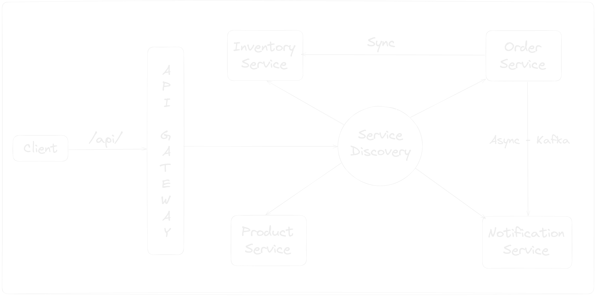

# Ecommerce microservices application in Kotlin

## Architecture Diagram

## Microservices Architecture Design Patterns

In this project, I have implemented several design patterns commonly used in microservices architecture

| Design Pattern               | Tools                                                                   |
|------------------------------|-------------------------------------------------------------------------|
| Service Discovery            | [Spring Cloud Netflix](https://spring.io/projects/spring-cloud-netflix) |
| API Gateway                  | [Spring Cloud Gateway](https://spring.io/projects/spring-cloud-gateway) |
| Circuit Breaker              | [Resilience4j](https://resilience4j.readme.io/docs/getting-startedy)    |
| Distributed Messaging System | [Apache Kafka](https://kafka.apache.org/)                               |