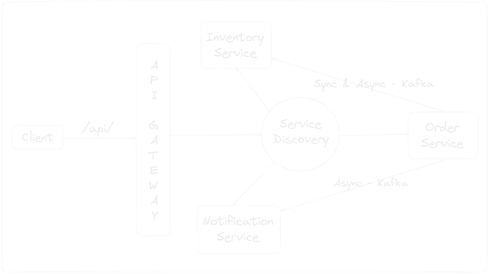
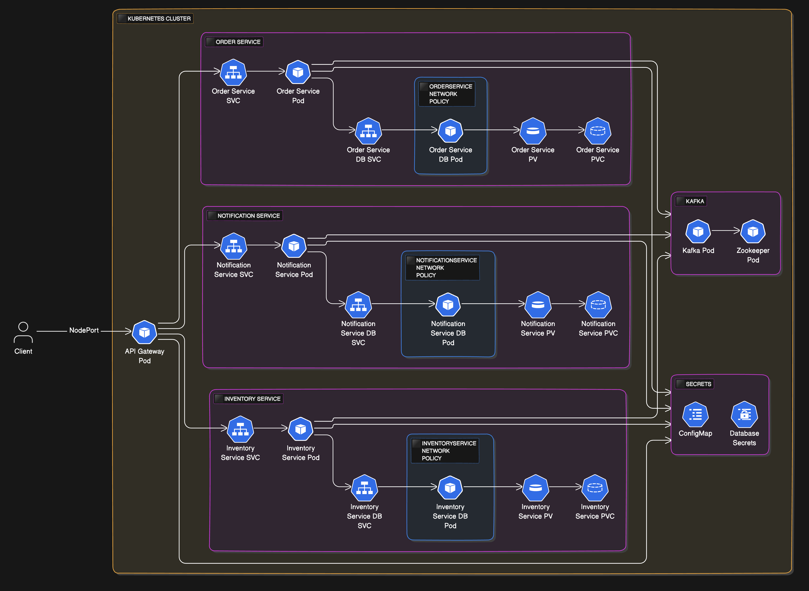

# Ecommerce Microservices Application in Kotlin

## Architecture Diagram

## Microservices Architecture Design Patterns

In this project, I have implemented several design patterns commonly used in microservices architecture

| Design Pattern                    | Tools                                                                                                                                  | Description                                                                                                      |
|-----------------------------------|----------------------------------------------------------------------------------------------------------------------------------------|------------------------------------------------------------------------------------------------------------------|
| **Service Discovery**             | [Spring Cloud Netflix](https://spring.io/projects/spring-cloud-netflix)                                                                | Service discovery automatically detects services for communication without relying on hardcoded addresses.       |
| **API Gateway**                   | [Spring Cloud Gateway](https://spring.io/projects/spring-cloud-gateway)                                                                | Single entry for managing, routing, and securing requests between clients and services.                          |
| **Circuit Breaker**               | [Resilience4j](https://resilience4j.readme.io/docs)                                                                                    | Prevents cascading failures by stopping repeated requests to a failing service and allowing it to recover.       |
| **Distributed Messaging System**  | [Apache Kafka](https://kafka.apache.org/)                                                                                              | Asynchronous communication between services in microservices environment.                                        |
| **Transactional Outbox Pattern**  | [Scheduler](https://docs.spring.io/spring-framework/docs/current/javadoc-api/org/springframework/scheduling/annotation/Scheduled.html) | Resolves the dual write problem by storing messages in an outbox table, ensuring consistency with business data. |
| **Event Inbox Pattern**           | [Inbox Database Table](https://softwaremill.com/microservices-101/#inbox-pattern)                                                      | Processes incoming events by storing them in an inbox table, ensuring idempotency and consistency.               |
| **Distributed Scheduler Locking** | [ShedLock](https://github.com/lukas-krecan/ShedLock)                                                                                   | Ensures only one instance of a scheduled task runs across multiple parallel application instances.               |

## Security Testing Topics

I have implemented below security testing automation pipelines

| Security Topic                       | Tools                                                                             | Implemented Pipeline                                                                       |
|--------------------------------------|-----------------------------------------------------------------------------------|--------------------------------------------------------------------------------------------|
| Static Application Security Testing  | [OWASP dependency-check](https://jeremylong.github.io/DependencyCheck/index.html) | [Service Vulnerability Scanner](.github/workflows/service-vulnerability-scanner.yaml)      | 
| Static Application Security Testing  | [Trivy Docker Image Scanner](https://trivy.dev/)                                  | [Service Docker Image Scanner](.github/workflows/service-image-vulnerability-scanner.yaml) | 
| Dynamic Application Security Testing | [OWASP ZAP Scanner](https://www.zaproxy.org/)                                     | [Service DAST Scanner](.github/workflows/service-dast-scanner.yaml)                        | 

## Kubernetes Architecture Diagram

## Kubernetes Architecture Components

|                             | Order Service                  | Inventory Service                  | Notification Service                  | API Gateway                  | Discovery Server                  |
|-----------------------------|--------------------------------|------------------------------------|---------------------------------------|------------------------------|-----------------------------------|
| **Docker Image**            | `shaikrasheed99/order-service` | `shaikrasheed99/inventory-service` | `shaikrasheed99/notification-service` | `shaikrasheed99/api-gateway` | `shaikrasheed99/discovery-server` |
| **Deployment**              | `order-service-deploy`         | `inventory-service-deploy`         | `notification-service-deploy`         | `api-gateway-deploy`         | `discovery-server-deploy`         |
| **Service**                 | `order-service-svc`            | `inventory-service-svc`            | `notification-service-svc`            | `api-gateway-svc`            | `discovery-server-svc`            |
| **Service Type**            | `NodePort`                     | `NodePort`                         | `NodePort`                            | `NodePort`                   | `NodePort`                        |
| **Service Port**            | `30002`                        | `30004`                            | `30003`                               | `30000`                      | `30001`                           |
| **Database Deployment**     | `order-service-db-deploy`      | `inventory-service-db-deploy`      | `notification-service-db-deploy`      |                              |                                   |
| **Database Service**        | `order-service-db-svc`         | `inventory-service-db-svc`         | `notification-service-db-svc`         |                              |                                   |
| **Database Service Type**   | `ClusterIP`                    | `ClusterIP`                        | `ClusterIP`                           |                              |                                   |
| **Persistent Volume**       | `order-service-pv`             | `inventory-service-pv`             | `notification-service-pv`             |                              |                                   |
| **Persistent Volume Claim** | `order-service-pvc`            | `inventory-service-pvc`            | `notification-service-pvc`            |                              |                                   |
