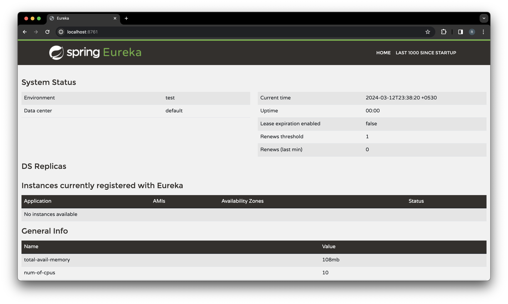

# Discovery Server

Service Discovery is a mechanism that helps different parts of a distributed system find and communicate with each other. 

It serves as a directory where services register themselves, making it easy for other services to locate and interact with them.

Discovery Server acts as a Eureka server which maintains a registry of all the downstream services, which are registered as Eureka clients. 

To enable Service Discovery functionality, I have integrated the [Spring Cloud Netflix](https://spring.io/projects/spring-cloud-netflix) library.

## How to test the availability?

Access this url `http://localhost:8761/` in browser and make sure you see the similar UI.

